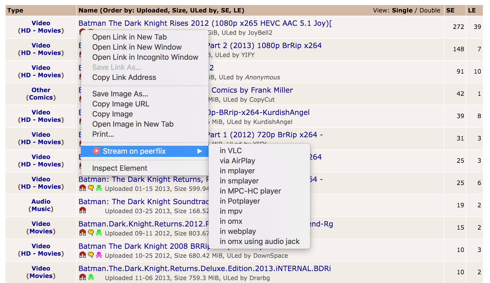

# Stream on peerflix - stream any torrent with peerflix #

Stream on peerflix is an extension for the [Google Chrome web browser](http://www.google.com/chrome).

It's based on [Shellac](https://github.com/acg/shellac)

## Screenshots ##

## Installation and Usage ##

Requirements:

* [Python](http://python.org/) (&gt;= 2.5)
* [Node](https://nodejs.org)
* [Peerflix](https://github.com/mafintosh/peerflix)

Run the web app server on the terminal:

    ./run

To install the Chrome extension:

* Bring up the extensions management page by clicking the wrench icon and choosing Tools &gt; Extensions. On a Mac, it's under "Window | Extensions".
* If Developer mode has a + by it, click the + to add developer information to the page. The + changes to a -, and more buttons and information appear.
* Click the Load unpacked extension button. A file dialog appears.
* In the file dialog, navigate to the `stream-on-peerflix/extension` folder and click OK.

If you right click on a torrent or magnet link you will see the context menu.
Then just select one of the options from the contect menu (VLC, AirPlay, etc).

## TODO ##

* Create node-webkit app and run webserver in background
* Show only installed media players
